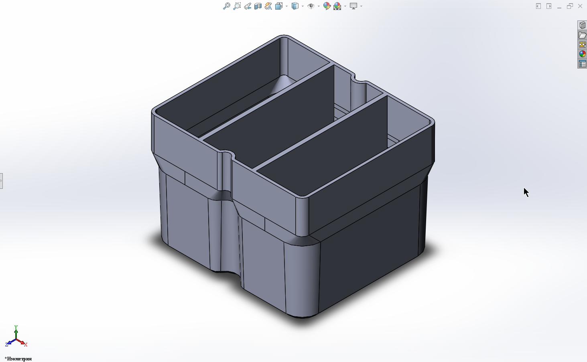
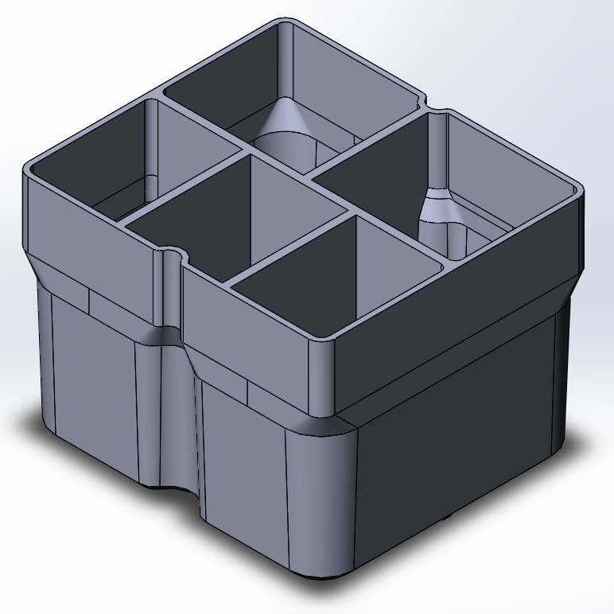
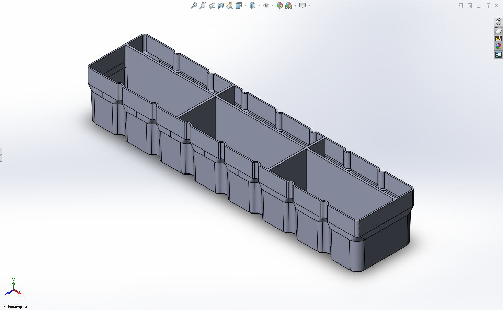

# BoxFinity

**BoxFinity** — это открытая параметрическая система хранения радиодеталей и мелкого крепежа, разработанная как эффективный гибрид кастомной 3D-печати и доступных готовых китайских органайзеров со съёмными перегородками.

Проект создан как ответ на главный недостаток популярной системы [Gridfinity](https://gridfinity.xyz/) — открытые контейнеры. Малейший случайный чих, прыгнувший кот или падение блока ячеек превращают идеальный порядок на столе в развлечение  Золушки по сортировке мелких деталей. **BoxFinity** пытается решить эту проблему, используя жёсткий закрытый корпус в качестве внешнего защитного скелета и 3D-печатные вставки для формирования внутренней топологии ячеек.

<p align="center">
  &nbsp;
  &nbsp;
  
</p>


---

## 🚀 Ключевые преимущества

* **Защита от «катастрофы чиха»:** Контейнер закрывается на защёлки. Его можно переворачивать, трясти или положить в авоську — детали останутся в своих анатомических карманах.
* **Экономия пластика и времени:** Больше не нужно тратить филамент на печать тяжёлых базовых плит (Baseplates) и толстых внешних стенок для каждого кубика. Вы печатаете только тонкостенные внутренние разделители.
* **Полная параметризация:** Модель полностью автоматизирована в SolidWorks через таблицы конфигураций (Excel). Топологию вставки легко модифицировать, добавив в таблицу нужную конфигурацию или использовав уже имеющуюся.

---

## 🛒 Исходные контейнеры (База)

Система BoxFinity спроектирована под стандартные, максимально доступные пластиковые органайзеры на 24 ячейки (размер бокса примерно 195х35х130 (ДхВхШ - такая уж у китайцев традиция для этих контейнеров :) ) мм, базовая внутренняя ячейка — 24х35х45 мм). 

Купить их можно тут:
* **Prom.ua:** [Пластиковий ящик для дрібниць (24 комірки)](https://prom.ua/ua/p3078261110-plastikovyj-yaschik-dlya.html)
* **AliExpress:** [Органайзер 24 ячейки](https://www.aliexpress.com/item/1005005479337493.html)

---

## 📊 Система кодирования параметров (Пример: `Г24-1-3-2-2-M`)

Обозначение вставки, определяющее её структуру:

`Префикс / Тип` — `Ц1` — `Ц2` — `Ц3` — `Ц4` — `Ц5`

* **Префикс (Г24):** **Г** — Горизонтальная серия (кейс-органайзер). **24** — Базовое количество фиксированных ячеек в стандартном боксе.
* **Ширина (Ц1):** Количество заводских ячеек, объединённых модулем по оси X (шаг кратен **24 мм**). Увеличение ширины, естественно, требует изъятия перегородок из бокса.
* **Количество строк (Ц2):** На сколько частей делится базовая глубина ячейки по оси Y (шаг деления равен **45 мм / Ц2**). Высота ячейки фиксирована и равна высоте контейнера — **35 мм**.
* **Строка 1 (Ц3):** Количество поперечных делений (кармашков) в первой строке ячейки. **Ограничение:** базовая ширина 24 мм делится максимум на **2 части**, иначе кармашки становятся слишком узкими для извлечения деталей.
* **Строка 2 (Ц4):** Количество поперечных делений во второй строке.
* **Строка 3 (Ц5):** Количество делений в третьей строке. Может принимать значение **M** (Merged) — это означает, что две последних строки объединены по оси Y для создания более глубокого кармана (под пинцет или длинные микросхемы вроде DIP-8/DIP-16).

### 💡 Пример физической реализации `Г24-1-3-2-2-M`:
Вставка занимает одну ячейку контейнера (24х45 мм) и делит её на три строки по глубине (шаг 15 мм). При этом:
* **Первая строка** делится пополам (`Ц3 = 2`). Получаем 2 кармашка внутренним размером около `12 х 15 мм` (без учёта толщины стенок). Идеально, например, для вертикального хранения оптронов PC817 (DIP-4), «как патронов в обойме».
* **Вторая и третья строки объединены (M)** и тоже делятся пополам (`Ц4 = 2`). Получаем 2 глубоких кармана размером `12 х 30 мм`. Сюда ложатся, например, оптроны PC829 (DIP-8), и их удобно подцеплять пинцетом за торцы корпуса.

```text
  ▲    ┌─────────────────────────────────────┐  ▲
  │    │      12 мм       │      12 мм       │  │
  │    │                  │                     │ 15 мм  (Строка 1)
  │    │   Ячейка PC817   │   Ячейка PC817   │  │
  │    ├──────────────────┴──────────────────┤  ▼
45 мм  │                  │                  │  ▲
  │    │                  │                  │  │
  │    │        Объединенн│ая глубокая       │  │
  │    │         зона (Мод│ификатор M)       │  │ 30 мм  (Строка 2 + 3 = M)
  │    │                  │                  │  │
  │    │   Ячейка PC829   │   Ячейка PC829   │  │
  ▼    └──────────────────┴──────────────────┘  ▼
       ◄─────────────── 24 мм ───────────────►
```

---

## 🛠️ Как пользоваться проектом

1. Скачайте мастер-файл детали **SolidWorks** (`.sldprt`) (версия 2020) и привязанную к нему таблицу конфигураций Excel из этого репозитория.
2. Откройте таблицу конфигураций, выберите нужную готовую топологию (или введите своё обозначение, не забыв растянуть формулы на добавившиеся строки).
3. SolidWorks автоматически перестроит 3D-модель.
4. Экспортируйте результат в `.STL` / `.3MF` и отправляйте на печать.

*Рекомендация по материалу:* Рекомендуется использовать светло-серый PLA/PETG пластик. Он обеспечивает хорошую контрастность для мелких чёрных корпусов радиодеталей, не очень маркий и, конечно же, "подчёркивает инженерную геометрию вставок".

---

## 🗺️ Планы на будущее (Дорожная карта)

* [ ] Добавление конфигураций под китайские контейнеры меньшего формата на 15 ячеек.
* [ ] Разработка **Серии В (Вертикальная)** — гибридная система хранения для стоечных наборных модулей производства фирмы Korp (https://prom.ua/ua/p2141774638-organajzer-vertikalnyj-modulnyj.html), использующая прозрачный листовой акрил (оргстекло) в качестве силового каркаса и 3D-печатные разделители для экономии филамента.

---

## 📄 Лицензия

Проект бесконечно опенсорсный и использует лицензию MIT. Делайте с ним, что хотите и улучшайте свои системы хранения!
